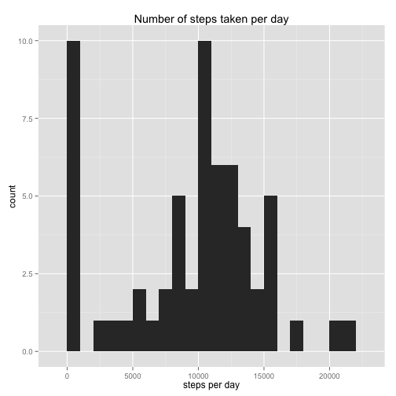
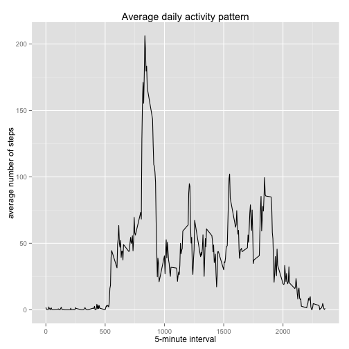
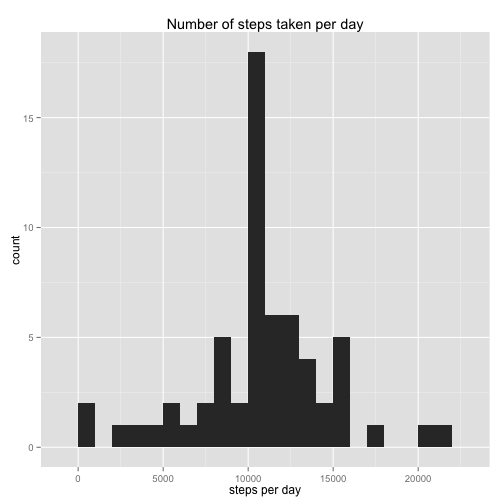
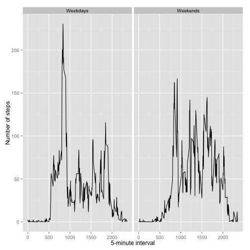

## Loading and preprocessing the data  


```r
activity_monitoring <- read.csv("activity.csv")
```

## What is mean total number of steps taken per day?  


```r
require(ggplot2)
steps_per_day <- sapply(split(activity_monitoring,activity_monitoring$date),function(x){sum(x[,1],na.rm = TRUE)})
mean_steps <- mean(steps_per_day)
median_steps <- median(steps_per_day)
qplot(steps_per_day,geom="histogram",binwidth = 1000,main="Number of steps taken per day",xlab="steps per day")
```

 

The average number of steps taken per day is 9354.23 and the median is 10395.

## What is the average daily activity pattern?  


```r
mean_interval <- sapply(split(activity_monitoring,as.factor(activity_monitoring$interval)),function(x){mean(x[,1],na.rm = TRUE)})
intervals <- as.integer(names(mean_interval))
qplot(intervals,mean_interval,geom="line",main="Average daily activity pattern",xlab="5-minute interval",ylab="average number of steps")
```

 

```r
max_interval <- names(sort(mean_interval,decreasing=TRUE)[1])
```

The 5-minute interval, that on average across all the days in the dataset, contains the maximum number of steps is 835.

## Imputing missing values


```r
number_NAs <- dim(activity_monitoring[!complete.cases(activity_monitoring),])[1]
```

The total number of missing values in the dataset is 2304.

The mean number of steps for each 5-minute interval was used to impute the missing values.


```r
for (i in 1:nrow(activity_monitoring)) {
   if (is.na(activity_monitoring[i,1])) {
       activity_monitoring[i,1] <- mean_interval[as.character(activity_monitoring[i,3])]
   }
}
steps_per_day <- sapply(split(activity_monitoring,activity_monitoring$date),function(x){sum(x[,1],na.rm = TRUE)})
mean_steps <- mean(steps_per_day)
median_steps <- median(steps_per_day)
qplot(steps_per_day,geom="histogram",binwidth = 1000,main="Number of steps taken per day",xlab="steps per day")
```

 

The average number of steps taken per day is 10766.19 and the median is 10766.19. These values differ from the estimates from the first part of the assignment, but not by much. In general, imputing missing data did not have a big impact on the estimates of the total daily number of steps.

## Are there differences in activity patterns between weekdays and weekends?


```r
for (i in 1:nrow(activity_monitoring)) {
    if (weekdays(as.Date(activity_monitoring[i,2])) %in% c("Saturday","Sunday")) {
        activity_monitoring[i,4] <- "weekend"
    } else {
        activity_monitoring[i,4] <- "weekday"
    }
}
activity_monitoring[,4] <- as.factor(activity_monitoring[,4])
mean_interval_week <- as.data.frame(t(sapply(split(activity_monitoring,list(as.factor(activity_monitoring$interval),activity_monitoring[,4])),function(x){c(mean(x[,1],na.rm = TRUE),x[1,3],as.factor(x[1,4]))})))
colnames(mean_interval_week) <- c("number_steps","interval","day_week")
mean_interval_week$day_week <- as.factor(mean_interval_week$day_week)
levels(mean_interval_week$day_week) <- c("Weekdays","Weekends")
ggplot(mean_interval_week, aes(x=interval, y=number_steps)) + geom_line() + facet_grid(~day_week) + xlab("5-minute interval") + ylab("Number of steps")
```

 

The highest number of steps occurs during the the weekdays, but in the weekends, in general, the mean number of steps throughout most of the intervals tend to be higher.
